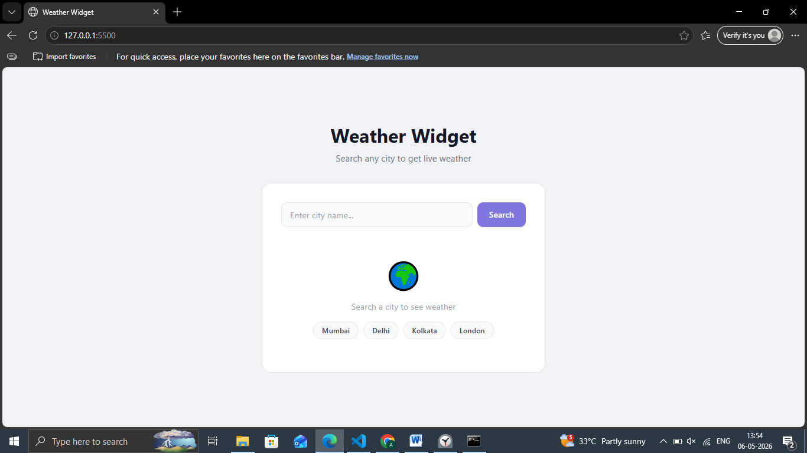
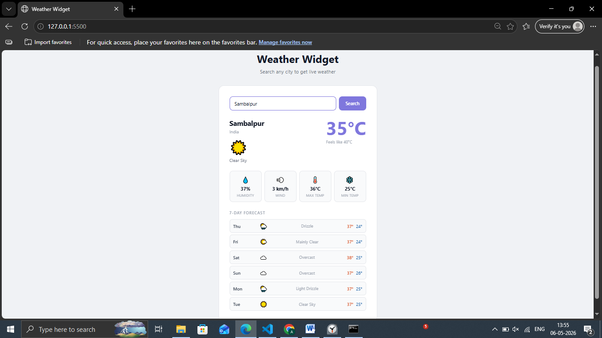

# Day 16 — Weather Widget

A live weather app using Open-Meteo API — no API key required!

## Preview

## Features
- Search any city worldwide
- Live temperature, humidity, wind speed
- Feels like temperature
- Max and min temperature for the day
- 6-day weather forecast
- Weather condition icons
- Quick city buttons for fast access
- No API key needed

## Tech Stack
- HTML5
- CSS3 (Grid, transitions)
- JavaScript (fetch, async/await, DOM)

## APIs Used
- [Open-Meteo](https://open-meteo.com) — free weather API
- [Open-Meteo Geocoding](https://open-meteo.com/en/docs/geocoding-api) — city to coordinates

## What I Learned
- Chaining two API calls (geocoding then weather)
- Mapping weather codes to icons and descriptions
- Parsing and displaying date/time data
- Handling API errors gracefully

## Part of
[30 Days 30 Projects](https://github.com/anmisha-dash/30-days-30-projects) challenge